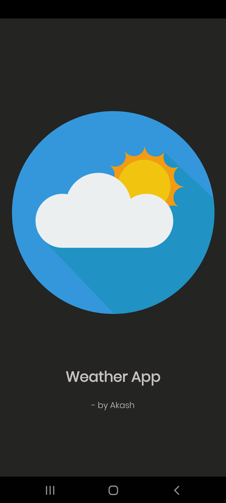
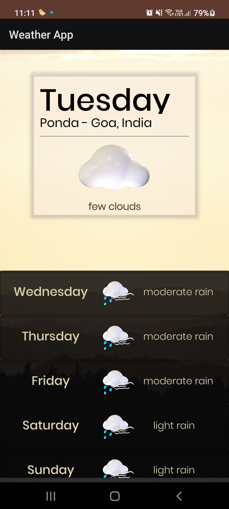
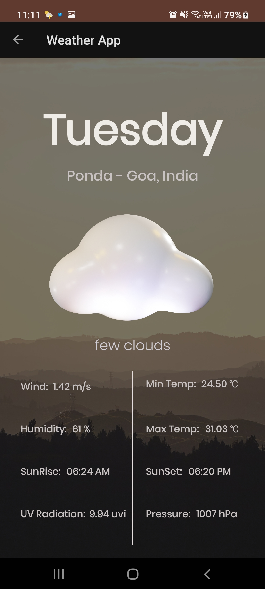
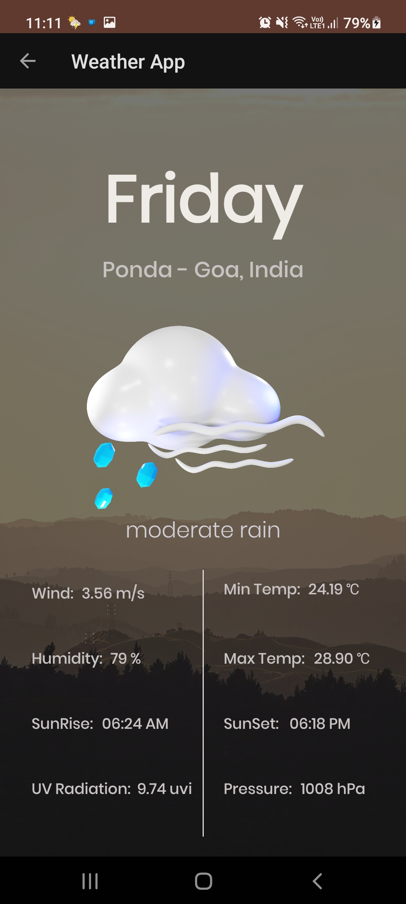
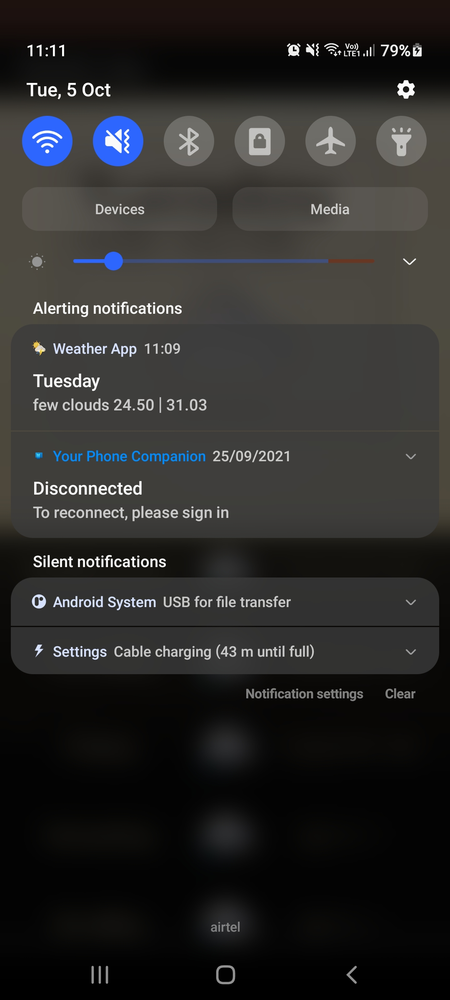

# WeatherApp
### Weather App that sends a notification to the user every 3 hours

#### Screens
      

#### Notification

[![Watch the video]](https://github.com/AkashCSanjeev/WeatherApp/blob/main/ScreenShots/Demo.mp4)
